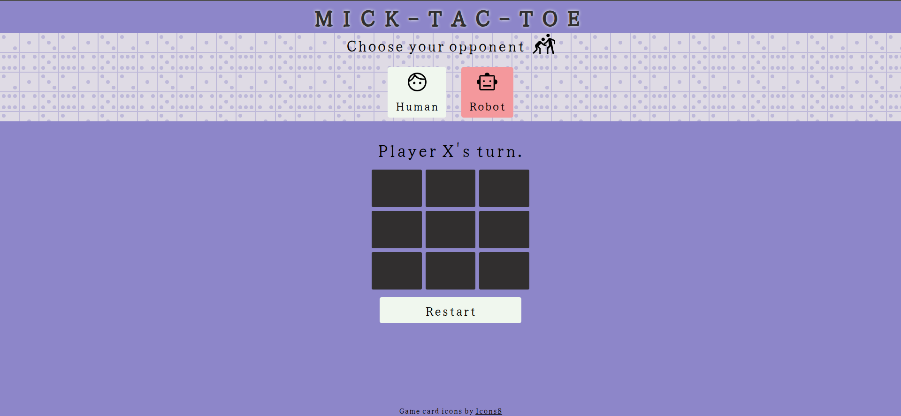
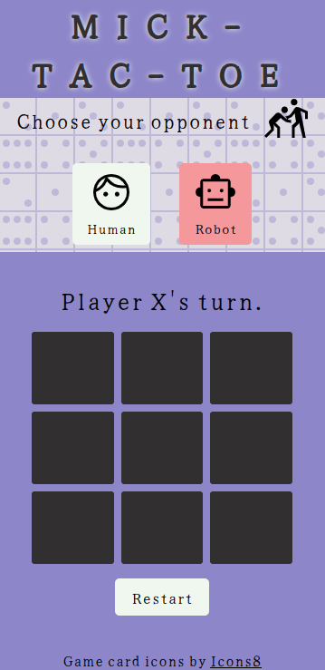

# ticTac

This is a project for a simple tic-tac-toe as part of [The Odin Project](https://www.theodinproject.com)

## Features

- Human playing
  Here you will be able to challenge another person in the game and the winner will be announced which will then
  require you to restart the game with the restart button.

- Robot Opponent
  Here you will play against an unbeatable AI computer player designed to beat you in every possible way.

## Algorithm

This AI player uses the Minimax algorithm that maximizes itself and minimizes the other player(you).
It then goes through all the possible moves and chooses the best move to either win or prevent the other
player from winning.

## Demo

The live project can be viewed live [here](https://mickfrog.github.io/ticTac)

## Preview

### Desktop Preview

### Mobile Preview

[MickFrog](https://www.github.com/MickFrog)
